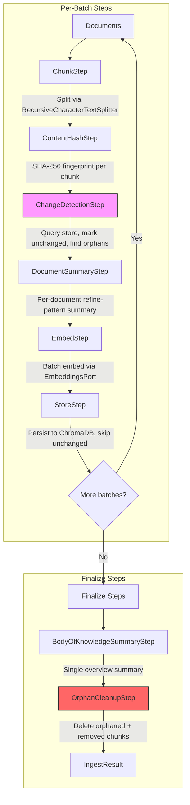

# Ingest Pipeline Engine

Composable step-based ingestion framework shared by all ingest plugins.

## Architecture

The pipeline engine (`engine.py`) executes an ordered list of `PipelineStep` implementations that share a mutable `PipelineContext`. Plugins compose their own pipelines by selecting which steps to include.

See [ADR 0008](../../../docs/adr/0008-composable-pipeline-engine.md) for the design rationale.

## Execution Modes

### Sequential Mode

All steps run on the full document set in one pass. Used for smaller ingestion jobs.

```python
engine = IngestEngine(steps=[chunk, hash, detect, summary, bok, embed, store, cleanup])
result = await engine.run(documents, collection_name)
```

### Batched Mode

Documents are partitioned into batches. `batch_steps` run per batch (each batch persisted independently), then `finalize_steps` run once on accumulated results. Used for large ingestion jobs to bound memory.

```python
engine = IngestEngine(
    batch_steps=[chunk, hash, detect, summary, embed, store],
    finalize_steps=[bok, cleanup],
    batch_size=5,
)
result = await engine.run(documents, collection_name)
```

## Pipeline Flow



## Steps Reference

| Step | Destructive | Description |
|------|:-----------:|-------------|
| **ChunkStep** | No | Splits documents using `RecursiveCharacterTextSplitter` with configurable `chunk_size` and `chunk_overlap` |
| **ContentHashStep** | No | Computes SHA-256 fingerprint from content + title + source + type + document_id |
| **ChangeDetectionStep** | No | Queries store for existing chunks, pre-loads embeddings on unchanged chunks, identifies orphans and removed documents. Sets `change_detection_ran = True` |
| **DocumentSummaryStep** | No | Per-document refine-pattern summaries for documents with >= `chunk_threshold` chunks. Skips unchanged documents when change detection is active. Supports concurrent summarization and optional inline embedding |
| **BodyOfKnowledgeSummaryStep** | No | Single overview summary for the entire knowledge base using section grouping (max 30,000 chars). Supports inline persistence when ports provided. Skips when no changes detected and BoK exists |
| **EmbedStep** | No | Batch embeds all chunks via `EmbeddingsPort`. Acts as safety net for any un-embedded chunks |
| **StoreStep** | No | Persists chunks to ChromaDB using content hash as ID. Skips chunks in `unchanged_chunk_hashes`. Deduplicates by storage ID within each batch |
| **OrphanCleanupStep** | **Yes** | Deletes orphaned chunk IDs and chunks from removed documents. Automatically skipped when prior errors exist |

## Safety Mechanisms

- **Destructive step gating**: Steps declaring `destructive = True` are automatically skipped when `context.errors` is non-empty. See [ADR 0010](../../../docs/adr/0010-pipeline-step-safety.md).
- **Content-hash deduplication**: Unchanged chunks skip re-embedding and re-storage. See [ADR 0006](../../../docs/adr/0006-content-hash-dedup.md).
- **Partial failure resilience**: Each step catches its own exceptions. A failing step records an error but does not terminate the pipeline.
- **BoK partial summary**: If a refinement round fails mid-way, the last successful partial summary is preserved.
- **Crash-safe ordering**: `OrphanCleanupStep` runs after `StoreStep` — new chunks are safely stored before orphans are deleted.

## Context Fields

| Field | Type | Set By | Used By |
|-------|------|--------|---------|
| `collection_name` | `str` | Plugin | All steps |
| `documents` | `list[Document]` | Plugin | ChunkStep |
| `chunks` | `list[Chunk]` | ChunkStep | All subsequent steps |
| `unchanged_chunk_hashes` | `set[str]` | ChangeDetectionStep | StoreStep, EmbedStep |
| `orphan_ids` | `set[str]` | ChangeDetectionStep | OrphanCleanupStep |
| `removed_document_ids` | `set[str]` | ChangeDetectionStep | OrphanCleanupStep |
| `changed_document_ids` | `set[str]` | ChangeDetectionStep | DocumentSummaryStep, BoKSummaryStep |
| `change_detection_ran` | `bool` | ChangeDetectionStep | DocumentSummaryStep, BoKSummaryStep |
| `document_summaries` | `dict[str, str]` | DocumentSummaryStep | BoKSummaryStep |
| `chunks_stored` | `int` | StoreStep | IngestResult |
| `chunks_skipped` | `int` | StoreStep | IngestResult |
| `chunks_deleted` | `int` | OrphanCleanupStep | IngestResult |
| `errors` | `list[str]` | Any step | Destructive gate, IngestResult |
| `metrics` | `dict[str, StepMetrics]` | Engine | Logging, observability |
