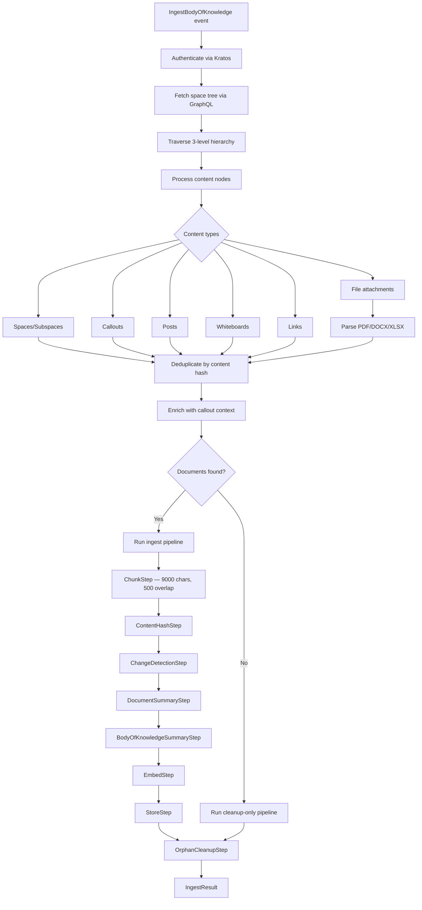

# Ingest Space Plugin

Fetches Alkemio space trees via GraphQL and ingests all content (posts, whiteboards, links, files) into the vector store.

## Overview

| Property | Value |
|----------|-------|
| **Plugin type** | `ingest-space` |
| **Event type** | `IngestBodyOfKnowledge` |
| **Queue** | `virtual-contributor-ingest-body-of-knowledge` |
| **Ports** | `LLMPort`, `EmbeddingsPort`, `KnowledgeStorePort` |
| **Collection** | `{body_of_knowledge_id}-{purpose}` |

## How It Works

End-to-end ingestion pipeline from Alkemio GraphQL API through vector storage.



### Space Tree Traversal

- **3-level hierarchy**: Space → Subspaces → Sub-subspaces
- **Content nodes**: Spaces, callouts, posts, whiteboards, links, file attachments
- **Callout context enrichment**: Parent callout title + truncated description (max 400 chars) prepended to each contribution
- **URI propagation**: Each document carries its Alkemio URI through the pipeline into vector store metadata
- **Link URI preference**: Link contributions use the link's own `uri` field over profile URL when available

### File Parsing

| Format | Library | Output |
|--------|---------|--------|
| PDF | `pypdf` | Extracted text per page |
| DOCX | `python-docx` | Paragraph text |
| XLSX | `openpyxl` | Cell values as text |

### GraphQL Client

- Kratos-authenticated HTTP client (`httpx`)
- Automatic retry with exponential backoff (max 3 attempts)
- Lightweight replacement for the former `@alkemio/client-lib` TypeScript dependency

## Configuration

| Variable | Default | Description |
|----------|---------|-------------|
| `CHUNK_SIZE` | `9000` | Characters per chunk (larger than website due to structured content) |
| `CHUNK_OVERLAP` | `500` | Overlap between chunks |
| `BATCH_SIZE` | `20` | Embedding batch size |
| `SUMMARY_CHUNK_THRESHOLD` | `4` | Minimum chunks to trigger per-document summarization |
| `SUMMARIZE_ENABLED` | `true` | Enable/disable summarization steps |
| `SUMMARIZE_CONCURRENCY` | `8` | Concurrent document summarizations |
| `ALKEMIO_SERVER` | _(required)_ | Alkemio API server URL |
| `AUTH_ADMIN_EMAIL` | _(required)_ | Kratos authentication email |
| `AUTH_ADMIN_PASSWORD` | _(required)_ | Kratos authentication password |

## Key Files

| File | Purpose |
|------|---------|
| `plugin.py` | Plugin implementation — pipeline composition, collection naming, zero-document handling |
| `space_reader.py` | Recursive space tree processor — traverses spaces, callouts, posts, whiteboards, links |
| `graphql_client.py` | Kratos-authenticated GraphQL client with retry logic |
| `file_parsers.py` | PDF, DOCX, XLSX file parsing |

## Testing

```bash
poetry run pytest tests/plugins/test_ingest_space.py
```
