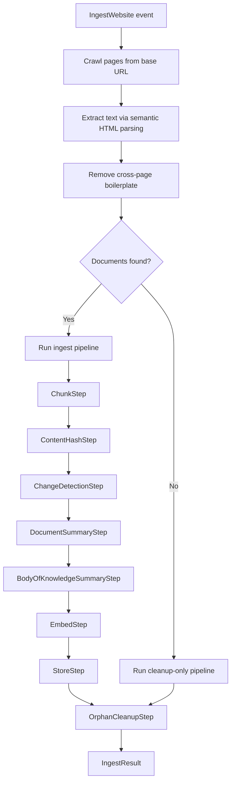

# Ingest Website Plugin

Web crawler that fetches, extracts, and ingests website content into the vector store.

## Overview

| Property | Value |
|----------|-------|
| **Plugin type** | `ingest-website` |
| **Event type** | `IngestWebsite` |
| **Queue** | `virtual-contributor-ingest-website` |
| **Ports** | `LLMPort`, `EmbeddingsPort`, `KnowledgeStorePort` |
| **Collection** | `{domain}-knowledge` (e.g., `example.com-knowledge`) |

## How It Works

End-to-end ingestion pipeline from web crawling through vector storage with content quality filtering.



### Content Quality

- **Semantic HTML extraction**: Extracts content from semantic tags only (`article`, `main`, `section`, `p`, `h1`-`h6`, etc.), stripping navigation, footers, and sidebars
- **Boilerplate removal**: Regex-based class/ID matching removes common boilerplate patterns (cookie banners, social widgets)
- **Cross-page deduplication**: Paragraphs appearing on >50% of crawled pages are removed (activates for 4+ pages; ignores paragraphs <20 characters)
- **Final URL tracking**: Records the post-redirect URL, not the pre-redirect URL

### Crawling

- Domain-boundary enforcement (stays on the same domain)
- Configurable page limit (default 20)
- SSRF protection against private IP ranges
- URL normalization (fragments, trailing slashes, query parameters)

## Configuration

| Variable | Default | Description |
|----------|---------|-------------|
| `PROCESS_PAGES_LIMIT` | `20` | Max pages to crawl |
| `CHUNK_SIZE` | `2000` | Characters per chunk |
| `CHUNK_OVERLAP` | `400` | Overlap between chunks |
| `BATCH_SIZE` | `20` | Embedding batch size |
| `SUMMARY_CHUNK_THRESHOLD` | `4` | Minimum chunks to trigger per-document summarization |
| `SUMMARIZE_ENABLED` | `true` | Enable/disable summarization steps |
| `SUMMARIZE_CONCURRENCY` | `8` | Concurrent document summarizations |

## Key Files

| File | Purpose |
|------|---------|
| `plugin.py` | Plugin implementation — pipeline composition, collection naming, zero-document handling |
| `crawler.py` | Recursive web crawler with SSRF protection and URL normalization |
| `html_parser.py` | Semantic HTML extraction and boilerplate removal |

## Testing

```bash
poetry run pytest tests/plugins/test_ingest_website.py
```
